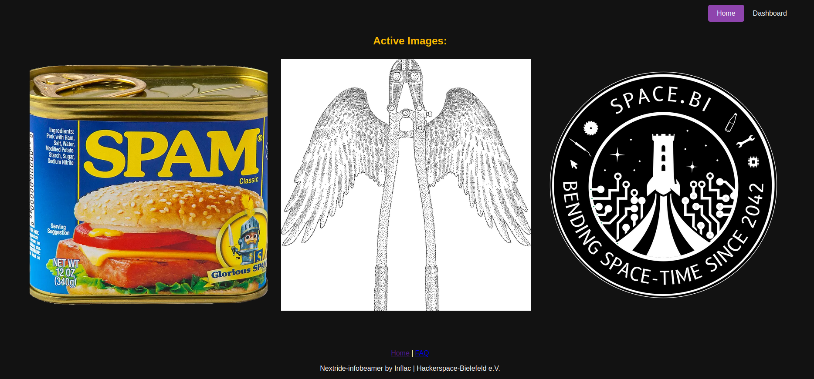
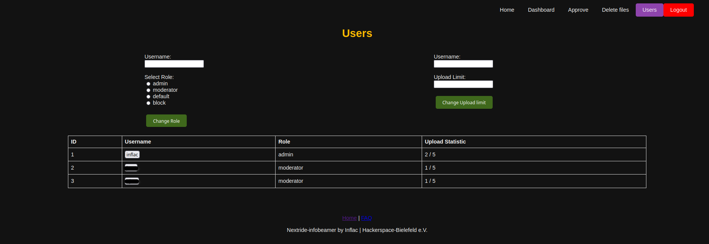

# Nextride2-infobeamer
Nextride2-infobeamer is an extension for [Nextride2](https://github.com/HackerspaceBielefeld/Nextride2) and implements a simple solution to display images on screens running Nextride.
N2i allows you to fetch a schedule and create a queue from the url elements. Those ressources are than itteratively displayed on the Nextride screens.
N2i also implements a CMS for user uploaded date. This can be used to allow guests and visitors to upload slides/ads they want to share.

| Home      | User management      |
|------------|------------|
|  |  |

## CMS Setup 
1. Clone the repository
2. Create a new github OAuth application [here](https://github.com/settings/applications/new)
3. Choose a name, the url to the index page and a description
4. As Authorization callback URL use http://yourdomain.tld/auth (http://127.0.0.1/auth for local development)
5. Register the app
6. Create a file named `.env` in the `html` folder.
7. Enter the information based on the sample file `dot_env_example`.
8. Create a virtual enviroment with: `python -m venv .venv` in the main project folder
9. Activate the venv with: `source .venv/bin/activate`(linux)
10. Install the necessary requirements with `pip install -r requirements.txt`
11. Enter the html folder again and start the application with `python app.py`

### Additional Steps
* You can Customize the favicong by changing the file `html/favicon.ico`

## Nextride2 Setup(for development)
Setting up Nextride2 is not necessary in order to use the CMS. 
In order to setup nextride2 for testing and development, do the following steps:
1. Clone the repository
2. Open it with Android Studio
3. Rename the file constants.example.dart > constants.dart
4. configure the constants.
5. Run the application e.g. for linux

## Restrictions
Please note! As N2i is currently under development not all features work reliable.
Please use the latest release for a stable and secure version of N2i.

## Todos
General:
* Setup more unittests
* Fix marked todos in code
* Implement CMS deactivation
* Add documentation and fix docstrings
